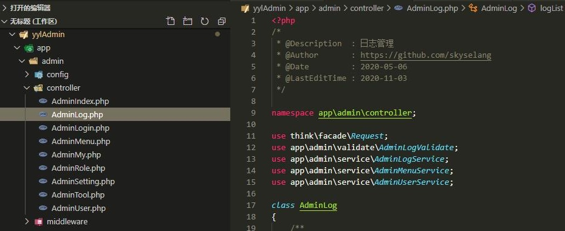
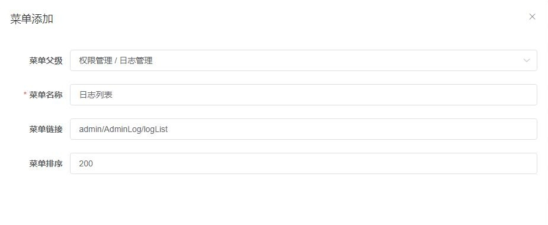
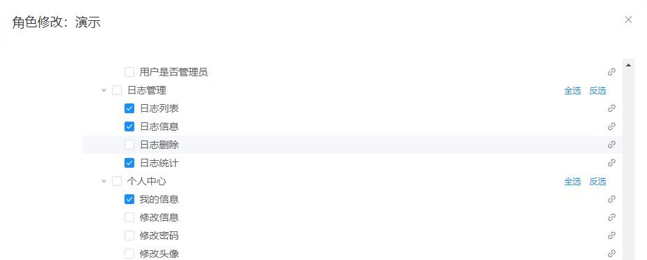
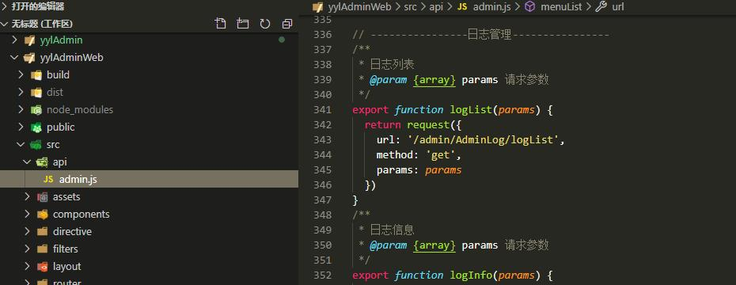
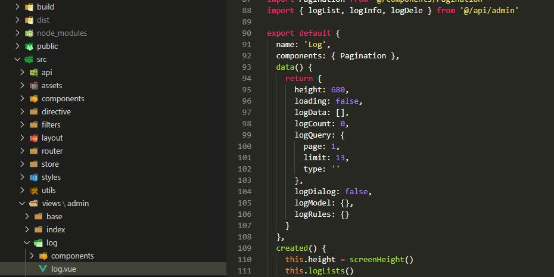
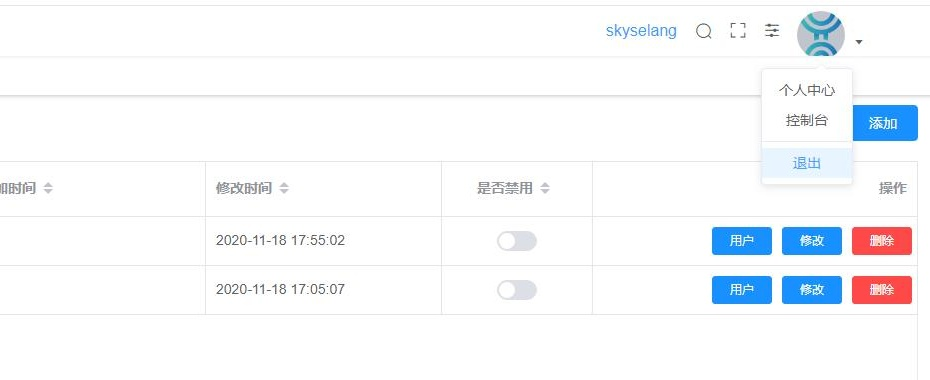
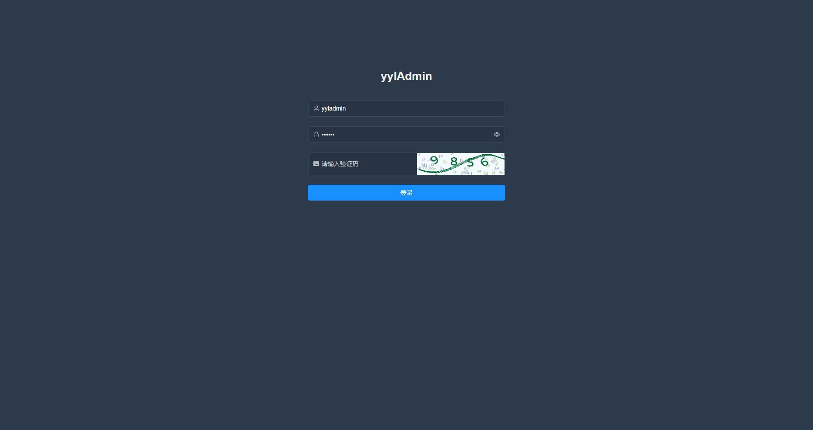
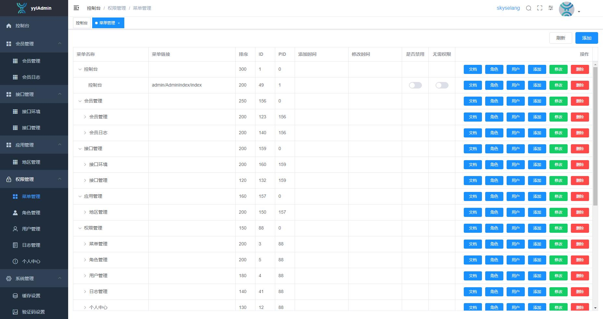

# yylAdmin

Gitee：<a href="https://gitee.com/skyselang/yylAdmin">https://gitee.com/skyselang/yylAdmin</a>  
Github：<a href="https://github.com/skyselang/yylAdmin">https://github.com/skyselang/yylAdmin</a>

## 简介

<a href="https://github.com/skyselang/yylAdmin" target="_blank">yylAdmin</a>是一个极简后台管理系统，只有登录退出、权限管理、日志管理等基本功能，方便扩展；前后端分离，后端采用ThinkPHP6，前端采用Vue2；项目由后端<a href="https://github.com/skyselang/yylAdmin" target="_blank">yylAdmin</a>和前端<a href="https://github.com/skyselang/yylAdminWeb" target="_blank">yylAdminWeb</a>组成。
- <a href="https://github.com/skyselang/yylAdmin" target="_blank">yylAdmin</a>
- <a href="https://github.com/skyselang/yylAdminWeb" target="_blank">yylAdminWeb</a>

## 演示

地址：<a href="https://demo.yyladmin.top" target="_blank">yylAdmin demo</a>  
账号：yyladmin、admin  
密码：123456  
提示：演示账号只有部分权限，请下载源码安装体验全部功能

## 准备

- <a href="https://www.xp.cn" target="_blank">PhpStudy</a>
- <a href="https://git-scm.com" target="_blank">Git</a>
- <a href="https://nodejs.org/zh-cn" target="_blank">Node</a>
- <a href="https://www.phpcomposer.com" target="_blank">Composer</a>
- <a href="https://www.kancloud.cn/manual/thinkphp6_0/1037479" target="_blank">ThinkPHP</a>
- <a href="https://cn.vuejs.org/v2/guide/syntax.html" target="_blank">Vue</a>
- <a href="https://element.eleme.cn/#/zh-CN/component/installation" target="_blank">Element</a>

## 要求

- PHP >= 7.1
- MySQL >= 5.6
- Redis

## 安装

### PHP部分
```bash
# 克隆项目
git clone https://github.com/skyselang/yylAdmin.git

# 进入项目目录
cd yylAdmin

# 安装依赖
composer install

# 可以通过composer镜像解决速度慢的问题
composer config -g repo.packagist composer https://mirrors.aliyun.com/composer/

# 导入数据库
数据库文件：public/private/yyladmin.sql

# 配置
重命名.env.example为.env，修改里面配置
或者直接修改config文件夹里面的相应配置

```

### WEB部分
```bash
# 克隆项目
git clone https://github.com/skyselang/yylAdminWeb.git

# 进入项目目录
cd yylAdminWeb

# 安装依赖
npm install

# 可以通过npm镜像解决速度慢的问题
npm install --registry=https://registry.npm.taobao.org
# 或者使用cnpm，安装后使用cnpm替代npm，如 cnpm install
npm install -g cnpm --registry=https://registry.npm.taobao.org

# 配置
在.env*环境变量文件里面修改接口地址

# 启动服务
npm run dev
```

### 访问

地址：http://localhost:9527  
账号：yyladmin  
密码：123456  
管理员：skyselang  
密码：123456

## 开发
> 以日志管理为例
### PHP部分
- 编写接口代码：app/admin/controller/AdminLog.php

- 添加菜单信息

- 分配相应权限


### WEB部分
- 新建接口文件：src/api/admin.js

- 新建页面文件：src/views/admin/log.vue

- 添加路由信息：src/router/index.js


### 刷新权限
- 退出重新登录


## 发布

```bash
# 构建测试环境
npm run build:stage

# 构建生产环境
npm run build:prod
```

## 其它

```bash
# 预览发布环境效果
npm run preview

# 预览发布环境效果 + 静态资源分析
npm run preview -- --report

# 代码格式检查
npm run lint

# 代码格式检查并自动修复
npm run lint -- --fix
```

## 预览





## FQA

### npm
- 推荐使用cnpm：<a href="https://developer.aliyun.com/mirror/NPM" target="_blank">cnpm</a>
- 删除node_modules文件夹后使用cnpm重新安装依赖

### ui
- 使用的是element-ui：<a href="https://element.eleme.cn/#/zh-CN/component/installation" target="_blank">element-ui</a>

### browser
- 支持Chrome、Firefox、QQ、360、Edge等主流浏览器，不支持IE以及浏览器的兼容模式（IE内核）

### debug
- 调试模式下根据接口返回错误信息排查，或者提<a href="https://gitee.com/skyselang/yylAdmin/issues" target="_blank">Issue</a>

## 协议

- Apache2开源协议，完全免费使用
- Copyright skyselang https://gitee.com/skyselang