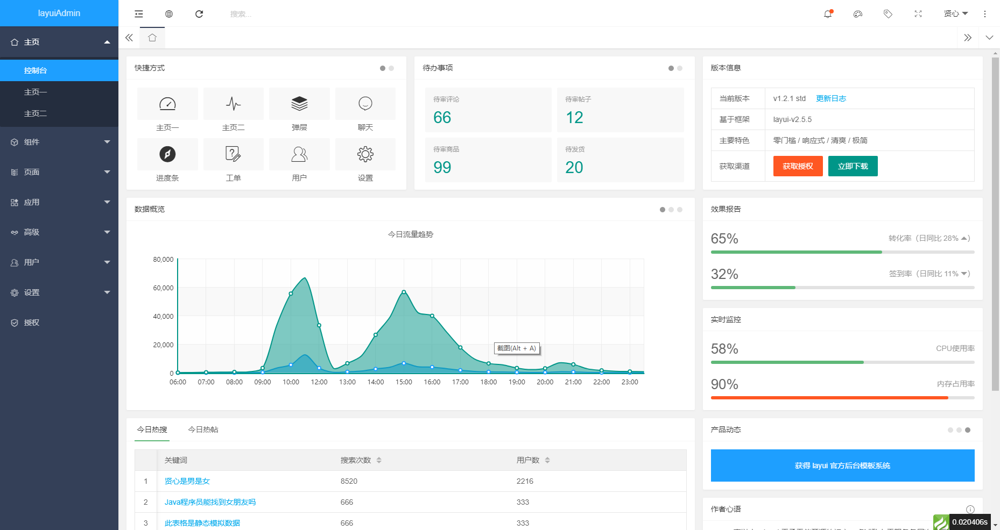

基于thinkphp6.0和layui2.5的php后台模板

需要掌握thinkphp和layui

thinkphp：+ [完全开发手册](https://www.kancloud.cn/manual/thinkphp6_0/1037479)

layui：+ [在线文档](https://www.layui.com/doc/)

### 使用
git clone 后在项目根目录执行 composer update（需要安装git和composer）

